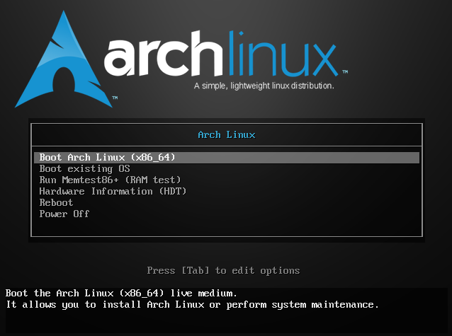
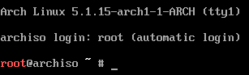
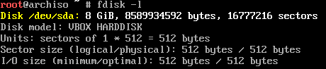
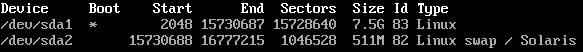
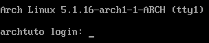
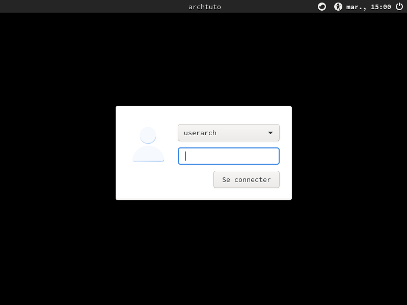
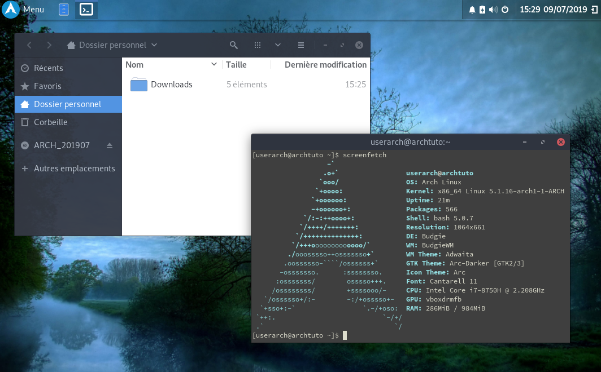

# Archlinux tutorial for beginner :books:

  
It is a step-by-step guide to getting a complete desktop environment with ArchLinux  
A large part of this tutorial is taken directly from the official documentation: [ArchWiki](https://wiki.archlinux.org/index.php/installation_guide)

## Prerequisites
- Download the [ArchLinux iso](https://www.archlinux.org/download/)
- Create a live USB
  - Before plugging in USB flash drive, write `ls /dev | grep sd` and see the list
  - Plugging in your USB flash drive
  - Write `ls /dev | grep sd` and you will see a new line like *sdX*
  - Run `dd if=/path/to/archlinux.iso of=/dev/sdX bs=1M && sync`

## Pre-installation

### 1 - Boot from your USB flash drive
First of all, you have to boot from your USB flash drive
- Plugging in your USB flash drive
- Power up your computer and press the key to enter in BIOS (depends on your motherboard but it's often `f1`, `f2` or `del`)
- Change the boot options to start from your USB and quit with validation

You will see this screen:


### 2 - The configuration
Select the first choise of the list and you will arrive on a virtual console as root:  
  

#### Keyboard layout
If your keyboard is not qwerty, you can change it. In my case (azerty), I have write:
`loadkeys fr-latin1` but if you want to see a complete list of available layouts, you can write `ls /usr/sahe/kbd/keymaps/**/*.map.gz`.

#### Internet connection
In this tutorial I use an ethernet cable.
- Write `ip link`, you will see something like `2: enp0s3: ...`
- Test your connection: `ping archlinux.org`, if it doesn't work, see the [third step of *Connect to the internet*](https://wiki.archlinux.org/index.php/installation_guide#Connect_to_the_internet) from the original tutorial.

#### System clock
Write these commands:
```bash
timedatectl set-ntp true
# to check the service status:
timedatectl status
# in my case I have to set the time zone:
timedatectl set-timezone Europe/Paris
```

#### Partition the disk
For simplicity, we will use 2 partitions (Linux and Linux Swap)
- Identify the disk to partition (in my case, it's the VBOX HARDDISK): `fdisk -l`  

- Partition with fdisk: `fdisk /dev/sdX`
- Follow these steps (press `enter` on each step):
  - **only if it's a new disk**, enter `o` (for BIOS) or `g` (for UEFI)
  - `n` (create the first partition, Disk size - Swap size)
  - `p`
  - `1`
  - `+7.5G`
  - `n` (create the swap, in my case 512M)
  - `p`
  - `2` + `enter`x2
  - `t` (set the swap to type Linux swap / Solaris)
  - `2`
  - `82`
  - `a` (set first partition bootable)
  - `1`
  - `p`, you will obtain something like this:
    
  - `w` (write your change to the disk)

#### Format the partitions
Write these commands:
```bash
mkfs.ext4 /dev/sdX1
mkswap /dev/sdX2
swapon /dev/sdX2
```

#### Mount the file systems
```bash
mount /dev/sdX1 /mnt
```

## Installation

### 1 - Install the base packages
```bash
pacstrap /mnt base
```

### 2 - Configure the system
Run these commands:
```bash
genfstab -U /mnt >> /mnt/etc/fstab
arch-chroot /mnt
# Adapt the next line to tour case
ln -sf /usr/share/zoneinfo/Europe/Paris /etc/localtime
hwclock --systohc
```

#### Localization
Uncomment your locale in `nano /etc/locale.gen` (ex. *en_GB.UTF-8 UTF-8*) and run `locale-gen` command.  
- Set the `LANG` variable:
  ```bash
  # enter in edition with: "nano /etc/locale.conf" and write:
  LANG=en_GB.UTF8
  ```
- Set the keyboard layout:
  ```bash
  # In my case it's an AZERTY keyboard
  # enter in edition with: "nano /etc/vconsole.conf" and write:
  KEYMAP=fr-latin1
  ```

#### Network configuration
- Create the hostname file:
  ```bash
  # enter in edition with: "nano /etc/hostname" and write your wanted hostname:
  archtuto
  ```
- Add matching entries to hosts:
  ```bash
  # enter in edition with: "nano /etc/hosts" and write:
  127.0.0.1 localhost
  ::1       localhost
  127.0.1.1 archtuto.localdomain    archtuto
  ```

#### Initramfs
Run `mkinitcpio -p linux`

#### Root password
Set your root password (ex. archtuto): `passwd`

#### GRUB
Your system is now installed but you can't boot without GRUB.
```bash
pacman -Syu grub
grub-install /dev/sdX
grub-mkconfig -o /boot/grub/grub.cfg
```
Now you can reboot your computer:
```bash
exit
umount -R /mnt
reboot
```
You should get this:  
  
In this tutorial:
- Login: root
- password: archtuto

## OS configuration
Now you have a complete install of ArchLinux but without graphical interface, before installing the desktop environment, we have to configure some things.

### 1 - Enable sudo
To be able to use root command under a normal user, we have to enable sudo.
```bash
# If the next command doesn't work, run: 'dhcpd enp0s3' before
pacman -Syu sudo
groupadd sudo
```
If you want to use `nano` to edit the file, run this command: `export EDITOR=nano`, else, you have to know the *vi* command.  
Run `visudo` and uncomment the line: `%sudo ALL=(ALL) ALL`, save and exit.

### 2 - Create user
Now we are going to create an user to avoid the use of root user.
```bash
useradd -m -G sudo -s /bin/bash userarch
# set a password to your new user (ex. userpwd)
passwd userarch
```

### 3 - Install NetworkManager
```bash
pacman -Syu networkmanager
systemctl enable NetworkManager.service
```

## Desktop Environment installation
In this tutorial, I will show you the installation of the [Budgie desktop](https://en.wikipedia.org/wiki/Budgie_(desktop_environment)) with Xorg, Gnome and Lightdm.  
Run these commands:
- `pacman -S xorg xorg-server`
- `pacman -S budgie-desktop`
- `pacman -S lightdm`
- `pacman -S lightdm-gtk-greeter`
  - Edit the file `/etc/lightdm/lightdm.conf`
  - Uncomment the `greeter-session` line and set value to `lightdm-gtk-greeter`
- `pacman -S termite` (a terminal)
- `pacman -S nautilus` (a file manager)
- `systemctl enable lightdm.service`
- `reboot`

With my AZERTY keyboard, I have to run a command before the reboot to set lightdm in AZERTY layout: `localectl --no-convert set-x11-keymap fr`

Felicitation, you will have this:  
  
By follow the [Extras step](#Extras-Beautify-your-installation), you can arrive to something like this:  


## Extras, Beautify your installation

A complete list of available applications can be found [here](https://wiki.archlinux.org/index.php/List_of_applications).

### Graphic configuration tools
To have graphic configuration tools, I suggest to install these packages:
- `sudo pacman -Syu gnome-control-center`
- `sudo pacman -Syu gnome-tweak-tool`

### Arc theme
To have a theme that I found beautier than the Adwaita default theme, I have install the [`arc-gtk-theme`](https://github.com/horst3180/arc-theme) and [`arc-icon-theme`](https://github.com/horst3180/arc-icon-theme) from [@horst3180](https://github.com/horst3180) (with `sudo pacman ...`).

### plymouth
*in writing*

### Beautiful GRUB
*in writing*
